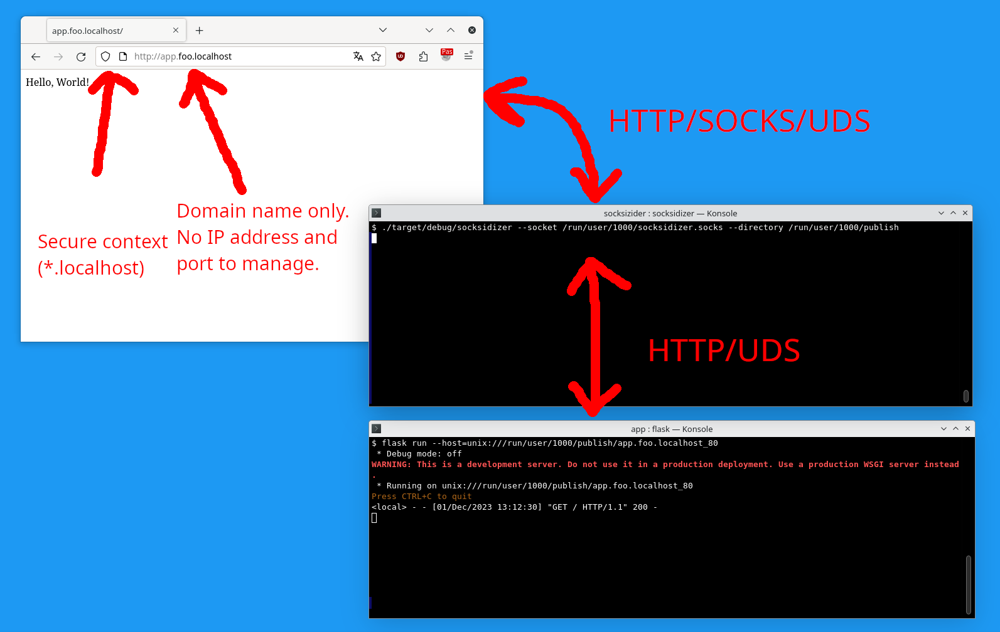

# Soxidizer

## Overview

**Summary:**

* Serve your local web applications (or other services) over Unix domain sockets (UDS).
* Give them a nice name such as `http://myapp.foo.localhost` (instead of `http://localhost:9405`).
* Other users on the system cannot access your local applications.
* Works with Firefox (with [FoxyProxy](https://addons.mozilla.org/en-US/firefox/addon/foxyproxy-standard/)) only.

**How:**
Soxidizer is [SOCKS5](https://datatracker.ietf.org/doc/html/rfc1928) proxy
which can listen on a [Unix domain socket](https://man7.org/linux/man-pages/man7/unix.7.html)
and connects to Unix domain sockets.
Firefox (with some help from [FoxyProxy](https://addons.mozilla.org/en-US/firefox/addon/foxyproxy-standard/))
can talk to this SOCKS proxy over the Unix domain socket
for a some chosen domain names (eg `*.foo.localhost`).

Example protocol stack:

<pre>
[HTTP  ]<-----------------------[HTTP ]
[SOCKS5]<-->[SOCKS5]
[UDS   ]<-->[UDS   |UDS]<------>[UDS  ]
Firefox     soxidizer           Service
</pre>

### Features

Current features:

* listen on Unix domain sockets;
* listen on TCP sockets;
* support for socket activation (TCP and UDP sockets);
* SOCKS5 protocol;
* SOCKS5 CONNECT method with a domain name (`socks5h`);
* connect to (`SOCK_STREAM`) Unix domain sockets (of the form `{directory}/{hostname}_{port}`).

Potential upcoming features:

* more flexible configuration;
* support for connecting to the requested service using a shell command (similar to OpenSSH `ProxyCommand`);
* SOCKS authentication.

Features which probably won't be implemented:

* SOCKS UDP ASSOCIATE command support;
* SOCKS BIND command support;
* SOCKS requests using IP address.

### Explanations

This works like this:

1. soxidizer accepts connection on some UDS socks (eg. `/run/user/${PID}/soxidizer.socks`);
2. soxidizer receives a SOCKS5 proxy (CONNECT) request from the client;
3. soxidizer translates this request into a pathname of the form `{directory}/{hostname}_{port}` (eg. `/run/user/${PID}/publish/myapp.john.local_443`) and connects to this socket;
4. soxidizer relays data between the client and the service.

This currently requires a client which supports SOCKS5 over UDS.
Firefox and its derivatives support this.
Other browsers currently do not support this.

## Build

~~~sh
cargo build
~~~

Build and execute:

~~~sh
cargo run -- "${XDG_RUNTIME_DIR}/soxidizer.socks" --directory "${XDG_RUNTIME_DIR}/publish"
~~~

## Usage

### Simple usage

~~~sh
soxidizer "${XDG_RUNTIME_DIR}/soxidizer.socks" --directory "${XDG_RUNTIME_DIR}/publish"
~~~

You should use a dedicated directory for storing the sockets of the published services.
Do *not* use a directory which contains other unrelated UDS (such as `${XDG_RUNTIME_DIR}` / `/var/run/${PID}`)
in order to make sure the proxy does not provide access to unrelated services.

Alternatively (or in addition), you can listen on a TCP socket:

~~~sh
soxidizer 127.0.0.1:9000 --directory "${XDG_RUNTIME_DIR}/publish"
~~~

### Systemd activation

Soxidizer will sockets passed through socket activation. For example:

~~~sh
systemd-socket-activate -l "${XDG_RUNTIME_DIR}/soxidizer.socks" soxidizer --directory /run/user/1000/publish
~~~

## Installation

### Installation of Soxidizer as a systemd user service

Create `~/.config/systemd/user/soxidizer.socket`:

~~~ini
[Unit]
Description=Socket for Soxidizer
ConditionUser=!root

[Socket]
Priority=6
Backlog=5
ListenStream=%t/soxidizer.socks
SocketMode=0600

[Install]
WantedBy=sockets.target
~~~

Create `~/.config/systemd/user/soxidizer.service`:

~~~ini
[Unit]
Description=Soxidizer
Requires=soxidizer.socket
ConditionUser=!root

[Service]
ExecStart=%h/bin/soxidizer
LockPersonality=yes
MemoryDenyWriteExecute=yes
NoNewPrivileges=yes
Restart=on-failure
RestrictNamespaces=yes
SystemCallArchitectures=native
SystemCallFilter=@system-service
Type=simple
UMask=0077
Slice=session.slice

[Install]
Also=soxidizer.socket
WantedBy=default.target
~~~

Enable the new units:

~~~sh
systemctl --user enable soxidizer.socket
systemctl --user enable soxidizer.service
~~~

Start listening on the socket:

~~~sh
systemctl --user start soxidizer.socket
~~~

## Security considerations

### Protection from other local users

On Linux, filesystem permissions are enforced for UDS:
a user can only connect to a (non-asbtract) UDS socket
if it has executable permissions on all parent directories and if it has write permission on the socket.
Storing the SOCKS5 socket under `${XDG_RUNTIME_DIR}` and using a subdirectory or `${XDG_RUNTIME_DIR}`
for services prevents other users from accessing them.

On other Unix systems, Soxidizer can be configured to check the user ID associated with incoming UDS connections.
The services would need to support a similar functionality in order to prevent other users from accessing them.

### CSRF attacks

Even if the service is only *directly* available to the system user,
a malicious website could still attempt to attack it by exploiting your browser (CSRF attack):
you should make sure your services are not vulnerable to CSRF attacks.

### DNS rebinding attacks

DNS rebinding attacks should not be possible if the services are only available over Unix domain sockets.

### Cookie hikjacking

If you serve your web application using `http://127.0.0.1:8000`,
your application cookies (if any) are *not safe from other local users*.
A local malicious user on the machine could run another services on `http://127.0.0.1:9000` and trick you into browsing to this service.
Your browser would then send your cookies associated with `http://127.0.0.1:8000` to the other user service
(because cookies currently [do not provide isolation by port](https://datatracker.ietf.org/doc/html/draft-ietf-httpbis-rfc6265bis#section-8.5)).
The malicious user could then use your session on your application.

By serving each application in a dedicated host name,
we can prevent different application from seing each others cookies.

### Cookies poisoning

Even if we are serving our application from `http://myapp.foo.ocalhost`,
we might still be vulnerable to *cookie poisoning*.
A malicious `http://local:9000` service,
could still set a cookie which would be available for `http://myapp.foo.localhost`
(`Set-Cookie: SESSION=123456; Domain=localhost`).

The application can protect itself from such an attacks by
always using [`__Host-`](https://datatracker.ietf.org/doc/html/draft-ietf-httpbis-rfc6265bis#section-4.1.3.2)
or [`__Secure-`](https://datatracker.ietf.org/doc/html/draft-ietf-httpbis-rfc6265bis#section-4.1.3.1) cookies.

Note: `__Secure-` cookies are available on Firefox from `http://*.localhost:*` origins.

## Client configuration

### Firefox

You can configure Firefox to use a UDS-based SOCKS proxy.
In the Network configuration:,

* usa a value of the form `file:///run/user/${PID}/soxidizer.socks` in SOCKS proxy;
* choose SOCKS5;
* the port is ignored.

However, this approach is not very usable.
All the requests are going to go through the SOCKS proxy
which currently does not support proxying to TCP/UDP.
Only your web sites will be handled by the proxy.
The solution is to install FoxyProxy standard (or a similar extension).

Note: it is not possible to configure UDS proxy using Proxy Auto-Configuration (`proxy.pac`).

### Firefox with FoxyProxy Standard

[FoxyProxy](https://addons.mozilla.org/en-US/firefox/addon/foxyproxy-standard/)
lets you define different network configurations depending on the target URI
i.e. you can use your default network configuretion (eg. no proxy) for most URIS
but use Soxidizer to reach some URIS (eg. `http://*.foo.localhost`).

In order to setup:

* open the FoxyProxy options;
* check "Proxy DNS";
* select the "Proxies" tab;

Sdd a new Proxy in the "proxies" tab:

* make sure the proxy is enabled;
* choose "SOCKS5" for the proxy type;
* in hostname use an address of the form `file:///run/user/${PID}/soxidizer.socks`;
* the port is ignored but you must enter a value port number.

Add a pattern for this proxy:

* use "include" for include,
* choose "wildcard" for type,
* enter something such as `*://*.foo.localhost` for the pattern,
* make sure it is enabled,

Select the "proxy by patterns" mode in order for the pattern to be honored.

### CURL

CURL can use a UDS SOCKS proxy with a proxy URI of the form:

~~~
socks5h://localhost/run/user/1000/soxidizer.socks
~~~

Example:

~~~sh
curl -x socks5h://localhost/run/user/1000/soxidizer.socks http://app.foo.local
~~~

## Service configuration

### Socket activation

If your application supports socket activation, you can use:

~~~sh
systemd-socket-activate -l "${XDG_RUNTIME_DIR}/publish/app.foo.local" ./myapp
~~~

### Installation of a service a systemd user service

If your application supports socket activation,
you can install your service as a systemd user service.
which will be automatically be started (on demand).

Create `~/.config/systemd/user/myapp.socket`:

~~~ini
[Unit]
Description=Socket for my app
ConditionUser=!root

[Socket]
Priority=6
Backlog=5
ListenStream=%t/publish/myapp.foo.localhost_80
SocketMode=0600

[Install]
WantedBy=sockets.target
~~~

Create `~/.config/systemd/user/myapp.service`:

~~~ini
[Unit]
Description=My app
Requires=foo.socket
ConditionUser=!root

[Service]
ExecStart=%h/bin/myapp
LockPersonality=yes
MemoryDenyWriteExecute=yes
NoNewPrivileges=yes
Restart=on-failure
RestrictNamespaces=yes
SystemCallArchitectures=native
SystemCallFilter=@system-service
Type=simple
UMask=0077
Slice=session.slice

[Install]
Also=foo.socket
WantedBy=default.target
~~~

Enable the new units:

~~~sh
systemctl --user enable foo.socket
systemctl --user enable foo.service
~~~

Start listening on the socket:

~~~sh
systemctl --user start foo.socket
~~~

### SSH relay

You can expose an application over a SSH tunnel.
If the remote service is available over TCP:

~~~sh
ssh target -N -L "${XDG_RUNTIME_DIR}/publish/app.foo.local_80:localhost:80"
~~~

If the remote sevice is available over UDS:

~~~sh
ssh target -N -L "${XDG_RUNTIME_DIR}/publish/app.foo.local_80:/run/foo.sock
~~~

### Podman

If your application is in a rootless (i.e. user) [Podman](https://podman.io/) container,
you can access it even if is not published by Podman:

~~~sh
pid="$(podman inspect $container -f '{{.State.Pid}}')"
nsenter -t "$pid" -U -n socat UNIX-LISTEN:${XDG_RUNTIME_DIR}/publish/app.foo.local_80,fork TCP:127.0.0.1:8000
~~~

### Flask

Using the `flask` command:

~~~sh
flask run --host=unix://${XDG_RUNTIME_DIR}/publish/app.foo.local_80
~~~

From Python:

~~~python
app.run(host="unix://" + os.environ["XDG_RUNTIME_DIR"] + "/publish/app.foo.local_80")
~~~

As a WSGI application: see below.

### Python WSGI applications

gunicorn can serve a WSGI application over UDS:

~~~sh
gunicorn --bind unix:${XDG_RUNTIME_DIR}/publish/app.foo.local_80 api:app
~~~

### Node.js

Node.js can serve web applications other UDS:

~~~js
server.listen(process.env.process.env.XDG_RUNTIME_DIR + "/publish/app.foo.local_80")
~~~

## FAQ

**Can I do the same thing with Chrome (or another browser)?**

Firefox and its derivative are the only browsers
which can talk to a SOCKS proxy over UDS.

We can have Soxidizer listen on TCP localhost instead.
In this case, we currently cannot prevent other local users from accessing the services
(on Linux, we could try to use `/proc/net/tcp` in order to find the peer used
but I am afraid this could be vulnerable to time-of-check to time-of-use race conditions).
Chrome [does not support authentication for SOCKS5](https://chromium.googlesource.com/chromium/src/+/HEAD/net/docs/proxy.md#SOCKSv5-proxy-scheme).

## References

* [Chromium feature request - Support HTTP over Unix Sockets](https://bugs.chromium.org/p/chromium/issues/detail?id=451721)
* [Firefox feature request - Support HTTP over unix domain sockets](https://bugzilla.mozilla.org/show_bug.cgi?id=1688774)
* [WHATWG feature quest - Addressing HTTP servers over Unix domain sockets](https://github.com/whatwg/url/issues/577)
* [proxy.onRequest failure to bypass proxy for localhost](https://bugzilla.mozilla.org/show_bug.cgi?id=1854324)
